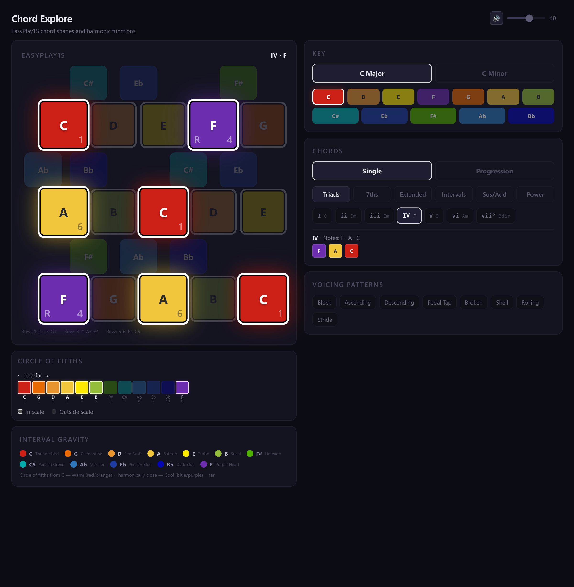

# Chord Explore

A single-page web app for visualizing chord shapes, harmonic functions, and chord progressions on the [EasyPlay1S](https://easyplay.io) 25-key MIDI controller grid.

Built as a learning tool for discovering chords and progressions on the physical device, using the **Interval Gravity** color system — each chromatic note has a permanent color based on its circle-of-fifths distance from C.



## Features

**Grid Visualization** — Physically accurate 6-row grid matching the real EasyPlay1S layout. Selected chord notes glow with their Interval Gravity colors while non-chord notes dim.

**6 Chord Categories** — Triads, 7ths, extended (9/11/13), intervals, sus/add, and power chords. All computed from a custom theory engine with diatonic resolution and Roman numeral notation.

**18 Chord Progressions** — Rock, jazz, blues, pop, R&B, and more. Animated playback cycles through chords with configurable speed. Voicing pattern animations sync with progression steps.

**8 Voicing Patterns** — Block, ascending, descending, pedal tap, broken, shell, rolling, and stride. Each generates a pitch sequence with distinct tap/hold animation on the grid.

**Audio Playback** — Synthesized saxophone tone via Web Audio API (zero dependencies). Sawtooth/square oscillators through a bandpass filter with delayed vibrato and feedback reverb. Notes fade naturally over 4 seconds.

**Keyboard Navigation** — Full arrow-key control of all right-column buttons. Up/Down between groups, Left/Right within rows, Enter to activate.

## Getting Started

```bash
npm install
npm run dev
```

Open http://localhost:5173 in your browser.

## Tech Stack

- React 19 + TypeScript
- Vite
- Tailwind CSS v4
- Web Audio API (no external audio libraries)

## Color System

The **Interval Gravity** color map assigns each chromatic note a permanent color based on circle-of-fifths distance from C. Colors never change with key or mode — transposition changes the theory, not the colors.

| Note | Color | Hex |
|------|-------|-----|
| C | Thunderbird | `#CC1F16` |
| G | Clementine | `#E86902` |
| D | Fire Bush | `#E99630` |
| A | Saffron | `#F2C73D` |
| E | Turbo | `#FFEA01` |
| B | Sushi | `#94BD3B` |
| F# | Limeade | `#50B000` |
| C# | Persian Green | `#01ACAB` |
| Ab | Mariner | `#2D76BA` |
| Eb | Persian Blue | `#1D3DA2` |
| Bb | Dark Blue | `#0407AF` |
| F | Purple Heart | `#6C2EAF` |

## License

Private project.